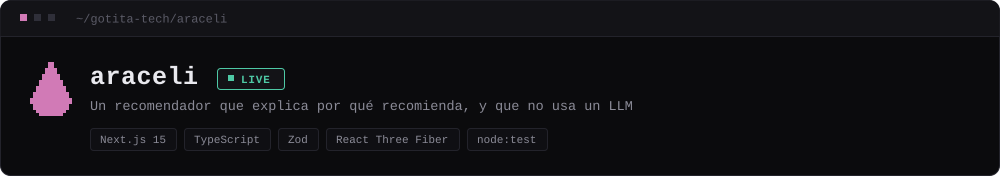
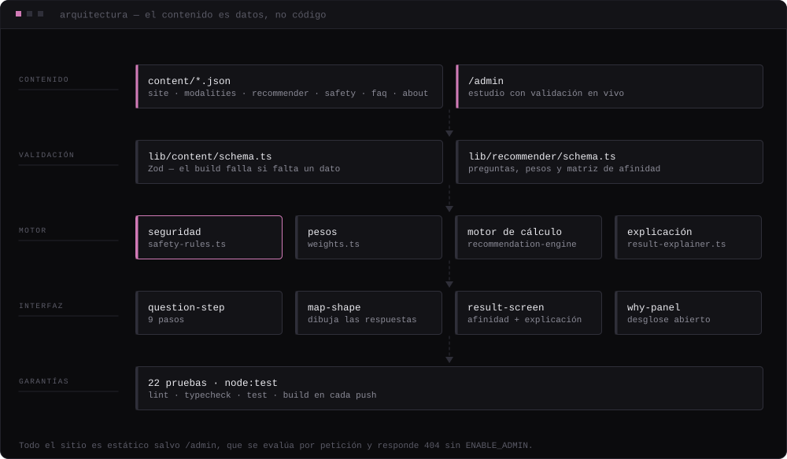

## 01 — OVERVIEW

Nueve preguntas dibujan una figura con las respuestas de la persona y calculan qué prácticas de bienestar tienen mayor afinidad con lo que quiere explorar. El motor es determinista y auditable, el contenido se valida con Zod en build, y 22 pruebas guardan las reglas de seguridad.

`Next.js 15` `TypeScript` `Zod` `React Three Fiber` `node:test`

**[Ver en vivo ↗](https://araceli-five.vercel.app)** · [el mapa ↗](https://araceli-five.vercel.app/mapa-interior)

## 02 — EL PROBLEMA

Elegir entre prácticas de bienestar depende casi siempre de un formulario de contacto o de la promesa de quien las ofrece. Quien llega no sabe por qué le proponen una cosa y no otra.

Y el atajo evidente —pedirle la recomendación a un modelo de lenguaje— es exactamente el que no se puede tomar aquí: en un dominio donde una sugerencia mal puesta hace daño, el criterio tiene que ser inspeccionable.

## 03 — LA SOLUCIÓN

**Tu Mapa Interior** son nueve preguntas que dibujan una figura con las respuestas y devuelven qué modalidades tienen mayor **afinidad** con lo que la persona quiere explorar hoy.

El cálculo es un motor determinista con pesos y reglas explícitas: las mismas respuestas producen siempre el mismo resultado, y cada resultado viene acompañado de por qué salió así. Un LLM podría, más adelante, redactar mejor un resultado ya calculado — nunca modificar una puntuación ni saltarse una regla de seguridad.

**Reglas del producto.** No son preferencias de estilo: el motor las hace cumplir y las pruebas las vigilan.

- Sin diagnóstico: ni el copy ni el motor infieren estados de salud.
- Sin promesas de eficacia.
- Nunca más de tres encuentros en la ruta inicial, y sólo más de uno si la persona pidió un proceso.
- El biomagnetismo no se ofrece por síntomas: requiere interés declarado y pasa por una comprobación de dispositivos implantados.
- Privacidad por defecto: el cálculo ocurre en el navegador y guardar es opcional.
- Nada inventado — ni testimonios, ni fechas, ni certificaciones.

## 04 — DEMO

| Entorno | URL |
| --- | --- |
| Producción | <https://araceli-five.vercel.app> |
| El mapa | <https://araceli-five.vercel.app/mapa-interior> |

**Rutas**

| Ruta | Contenido |
| --- | --- |
| `/` | Portada |
| `/mapa-interior` | La experiencia en página completa |
| `/practicas` | Todas las prácticas |
| `/practicas/[slug]` | Ficha con los cinco bloques obligatorios |
| `/sobre-araceli` | Trayectoria y formación |
| `/conversar` | Canales de contacto |
| `/privacidad` | Cómo se tratan las respuestas |
| `/admin` | Estudio de contenido (sin indexar) |

## 05 — CÓMO FUNCIONA

- **Nueve preguntas, ningún dato personal.** El cuestionario no pide nombre, documento ni historia clínica. Una prueba lo verifica en cada commit.
- **Normalización.** Las respuestas se proyectan sobre dimensiones normalizadas entre 0 y 1 (`lib/recommender/weights.ts`).
- **Seguridad antes que recomendación.** Si el texto libre sugiere una situación que requiere atención sanitaria, no se puntúa nada y se acompaña hacia un profesional cualificado (`lib/recommender/safety-rules.ts`).
- **Afinidad, no eficacia.** La puntuación mide compatibilidad con lo que la persona declaró; nunca probabilidad de que algo funcione.
- **Explicación.** `lib/recommender/result-explainer.ts` traduce el cálculo a lenguaje que la persona puede contrastar con lo que respondió.
- **Cuando no hay señal, no se inventa.** Respuestas poco concluyentes dejan el mapa abierto en lugar de rellenarlo.

## 06 — STACK

`Next.js 15` `TypeScript` `Zod` `React Three Fiber` `node:test`

```bash
npm install
npm run dev
```

| Comando | Qué hace |
| --- | --- |
| `npm run dev` | Servidor de desarrollo |
| `npm run build` | Build de producción |
| `npm run lint` | ESLint |
| `npm run typecheck` | TypeScript en modo estricto |
| `npm test` | Las 22 pruebas del motor |
| `npm run check` | Lint + typecheck + pruebas |

**Variables de entorno**

| Variable | Necesaria | Para qué |
| --- | --- | --- |
| `NEXT_PUBLIC_SITE_URL` | Recomendada | Fija URL canónicas, sitemap y Open Graph. Sin ella se usa el dominio de Vercel y, en local, content/site.json |
| `ENABLE_ADMIN` | Opcional | `true` publica el estudio de contenido en /admin. Sin ella la ruta responde 404 en producción |

## 07 — ARQUITECTURA



Todo el sitio es estático salvo /admin, que se evalúa por petición y responde 404 sin ENABLE_ADMIN.

### Editar contenido sin tocar código

Todo lo administrable vive en `/content` como JSON validado con Zod:

| Archivo | Qué contiene |
| --- | --- |
| `site.json` | Titulares, secciones, contacto, textos legales |
| `modalities.json` | Ficha de cada práctica: los cinco bloques y los datos comerciales |
| `recommender.json` | Preguntas, pesos del motor y matriz de afinidad |
| `safety.json` | Enrutamiento de seguridad y comprobaciones previas |
| `faq.json` | Preguntas frecuentes |
| `testimonials.json` | Testimonios (sólo reales) |
| `about.json` | Trayectoria y formación |

En `/admin` hay un estudio que edita estos archivos con validación en vivo y descarga del JSON resultante. Si un dato obligatorio falta o es incoherente, **el build falla**: no llega a producción.

### Decisiones técnicas que costaron encontrar

- **Framer Motion 13.** La versión importa: en 12.43 las salidas de `AnimatePresence` no se completaban con React 19.2. El modal usa además montaje controlado (`usePresence`) porque su interior tiene animaciones anidadas y el cierre debe ser determinista.
- **React Three Fiber** sólo en el agua del hero y del cierre: un plano con shader, cargado dinámicamente y sólo si el dispositivo lo justifica (`use-perf-tier`).
- **Pruebas con el runner nativo de Node** y un cargador propio (`test/loader.mjs`) que resuelve el alias `@/` y los JSON de contenido — sin añadir un framework de test al proyecto.

### Documentación

- [Auditoría y arquitectura](./docs/auditoria-y-arquitectura.md) — producto, UX, sistema visual, componentes, responsive, animación, accesibilidad y rendimiento.
- [Motor de orientación](./docs/motor-de-recomendacion.md) — cálculo, explicabilidad, seguridad y cómo ajustarlo.

## 08 — ESTADO ACTUAL

- Desplegado y accesible. CI en verde: lint, tipos, 22 pruebas y build de producción en cada push a `main`.
- Las previsualizaciones responden `Disallow: /` y llevan `noindex`: ningún despliegue de prueba acaba en un buscador.
- Actualización del 8 de octubre de 2026: contacto confirmado, logotipo y retrato auténticos de Tiempo Interior, imágenes de ambiente para las nueve prácticas y fuentes locales. Los testimonios y datos de formación pendientes no aparecen en el sitio público. [Entrega y procedencia de imágenes](docs/entrega-2026-10-08.md).

## 09 — SIGUIENTE ITERACIÓN

- Completar ciudad, horarios, valores actuales, formación y testimonios con consentimiento.
- Migrar `next lint` a la CLI de ESLint antes de que Next 16 lo retire.
- Explorar el uso de un LLM sólo en la capa de redacción del resultado, sin acceso a las puntuaciones ni a las reglas de seguridad.


<sub>Parte de **[GOTITA//TECH](https://github.com/gotita-tech/gotita-tech)**. Este README se genera desde el manifiesto del perfil; para cambiarlo, edita `projects.json` allí y vuelve a ejecutar `kit/build.mjs`.</sub>
